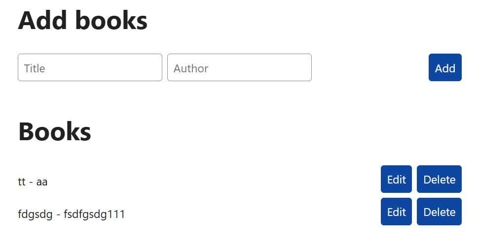

# hono-drizzle-neon-starter

A serverless API starter on Cloudflare Workers with Hono, Drizzle ORM, and Neon Postgres—Type-safe schema, edge-first routing, and zero-cold-start DX.



```txt
bun install
bun run dev
```

```txt
bun run build
bun run preview
bun run deploy
```

---

```ts
bun i zod
bun i @hono/zod-validator
```

zod → The core validation library (for defining schemas).

@hono/zod-validator → Hono’s glue code that connects those schemas to route requests.

File creation order: index -> book -> client

connect to neon postgresql

```ts
bun i drizzle-orm @neondatabase/serverless dotenv
bun i -D drizzle-kit
```

```
bun run db:generate to generate the schema
bun run db:migrate to migrate the schema
```
